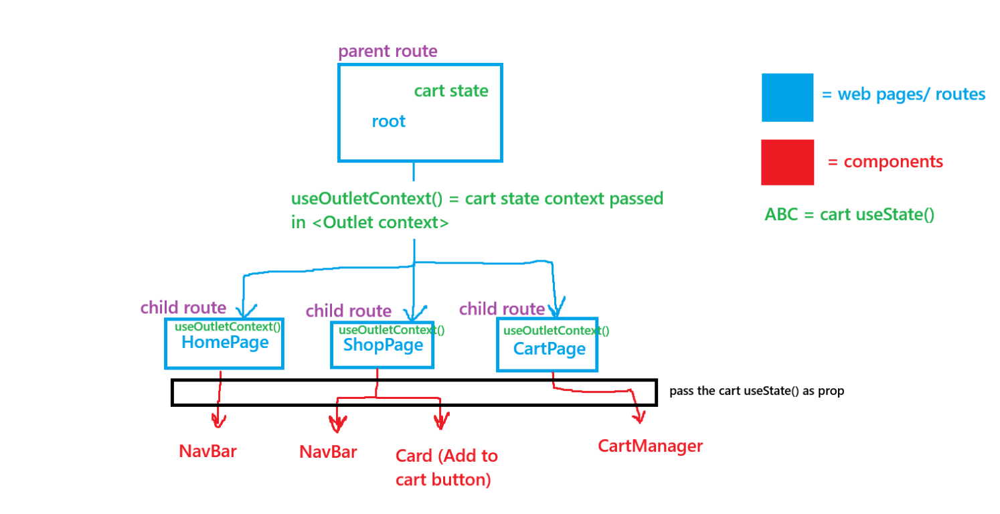

# react shopping cart project from the odin project

- Things to focus on:
  - Think about folder structure and what components I need. Think about the entire sections of the project in a component mindset.
  - Organize components and folders with local CSS from last lesson. My personal goal is to utilize CSS modules.
  - Track and document what every component does. Make sure to keep track of state and useEffects() and all that. Keep
    file dependencies modular and contained in the component itself.

Project Requirements:

- In total, should have 3 pages:
  1. a homepage
  2. a shop page
  3. a cart page

- Should let the user navigate between the pages with a navigation bar which will be shown on all pages at all times.

- Homepage can be designed with whatever I want. Images, and other stuff is mainly there to test the concepts I've learned.

- Shop page requirements:
  - Should contain card elements for each product shown to the user.
  - Each card should have an input field on it which lets the user manually type how many of the product they want, or
    a increment/decrement button next to it for fine tuning the amount of products. Can also have a Add-to-Cart button as well.
  - Items that are displayed in the shop page should be fetched from an API.

- Cart page requirements:
  - When there are any items added to the cart, the cart page link in the navbar should have a number next to it to indicate
    how many total items are in the cart currently. This number next to the navbar link should update in real time as the user is adding
    stuff to the cart.
  - On the cart page, the user should be able to see all the items added to the cart and the quanitites of each item, and allow the
    user to increase/decrease the quantity of items in their cart. Should ALSO INCLUDE AN OPTION TO REMOVE/DELETE ITEM FROM THE CART.
  - The odin project specifies that there is no requirement to implement a checkout/payment system.

- Clear out any "missing in props validation" (react type checking with PropTypes)

- Test out the app thoroughly with RTL (react-testing-library)
  - One thing the project notes is to not accidentally test the "react-router-dom" directly since this is an external library. It just means
    to not test that the actual act of routing works, but I SHOULD test if the behavior as routing happens works (like if the UI renders correctly
    after routing).

- Style application how I would like.

- Make sure to deploy it on the Paas (platform as a service). Last time I used Netlify, and there is a note on the project itself to
  include as an option for SPA's and redirects.

## Concepts used in project:

Project goes over concpets such as:

- fetching from an API in react with useEffect() and managing 3 fetch states (loading, data, error). Also cleaning up with AbortController.
- properly managing state with useState, setState function. Make sure to treat state as immutable.
- testing react components with vitest and RTL user-interactions, and mocking external sources (API calls).
- checking props passed are the correct type with PropTypes.
- using CSS modules or CSS-in-js to style react components, and keep CSS local to the component instead of global.

## notes to myself

- note: adding a selector after a pseudo class lets the pseudo class/event affect the other selector as well.
  ex:
  button:hover .someotherelement {
  /_these will affect the other element when button:hover_/
  }

- For react testing with routes, you need to make a whole new router (preferably a memoryRouter since it uses no DOM). This allows us to
  render our own router with <RouterProvider router={theTestRouter} /> in the render() function inside the test. This renders the whole route
  including the child routes so I can use userEvent to simulate user interactions with navigation elements, then check if the actual location
  object path is correct with "theTestRouter.state.location.pathname" which returns the current path the testRouter is on.
  - memory routers have many utilities, but .state returns the current state of the router, .location returns a location object that
    has information related to the current route, and .pathname is the literal current route name.

- When mocking API fetch calls inside of react tests with vitest, I mainly used the vi.fn() method to mock the global fetch function
  by doing:
  global.fetch = vi.fn()
  which replaces the global fetch function for that test. That way whenever anything within that test calls fetch, it will execute whatever
  is inside the .fn() function, but I can set it to resolve to whatever I want or reject an error. I can also specify what kind of successful
  response or error I want it to return. But the ruleset I found was:
  1. to simulate a successful response:
     global.fetch = vi.fn(() => Promise.resolve(response goes here));
     - and the response can be a custom response object with a custom JSON returned, like:
       ex:
       const tempResponse = { something: "data is here" };

       then:
       global.fetch = vi.fn(() => Promise.resolve({
       ok: true, // this is the "ok" status from the response object
       status: 200, // this is the response status code that is returned from the response object
       json: () => Promise.resolve(tempResponse), // the actual JSON data returned from the response object. we are returning the tempResponse
       }));

  2. to simulate a unsuccessful/error response:
     global.fetch = vi.fn(() => Promise.reject(new Error("custom error message")));

Once I've mocked my fetch calls, I can render my component, function, or whatever makes the api call and it will use that mocked version instead of the
actual API during testing.

render(<myComponentThatCallsFetch />);

- Also, make sure to re-check any try-catch-finally blocks. I made one inside ImgCarousel.jsx, but it wasn't working because
  I put the fetch logic inside of another function while my try-catch-finally block was on the outer shell. When I moved it inside
  of the same function as the fetch request, now it works, so make sure that the try-catch-finally blocks are scoped properly if they
  aren't rendering things properly.

- when using userEvents from the RTL userEvents, make sure to make the action await because the 
userEvents are asynchronous so they have to wait for re-renders or other factors triggered by the event.

- when testing, you cannot test browser built-in features like native input="number" increment and decrement arrow key behavior, nor is there 
any need to since I didn't make the built-in feature.

- So the "cart" useState is needed by a couple components located on different webpages/routes to work properly:
    1. shop page: needs the cart setState to "Add to Cart"
    2. cart page: needs the cart state itself to display all the cart items visually with editing/removal functionality
    3. NavBar component (all webpages): needs to display the amount of items in the cart at all times, even during navigation 

  I ended up lifting the state up to the parent route component, the "root" page which holds the state. This way the child routes 
  that are formed using <Outlet> can be provided a "context" and then the child routes can invoke the "useOutletContext()" to get and 
  destructure the state as needed.

  diagram I drew up:
  
