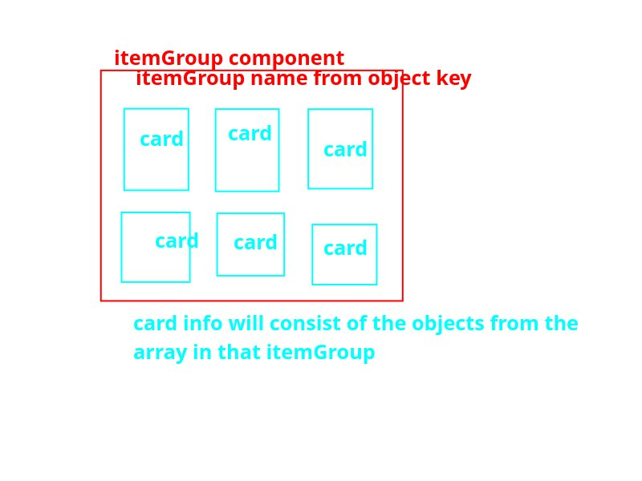

# The plan

- So I just got done with the data processing of the items where I condensed all the items into their respective
categories in a single object, and now I just need a way to display the data, but my plan is to make two 
child-components so that I can display them all together as a group in multiple <ul>: 

    1. card component: this is going to be the card of the item. It just contains the information of the item.

    2. itemGroup component: this is going to be either a <ul> or a 
, but its going to be a container of the cards for THAT 
    item group, with the item group name being at the top. 

drawn plan: 

